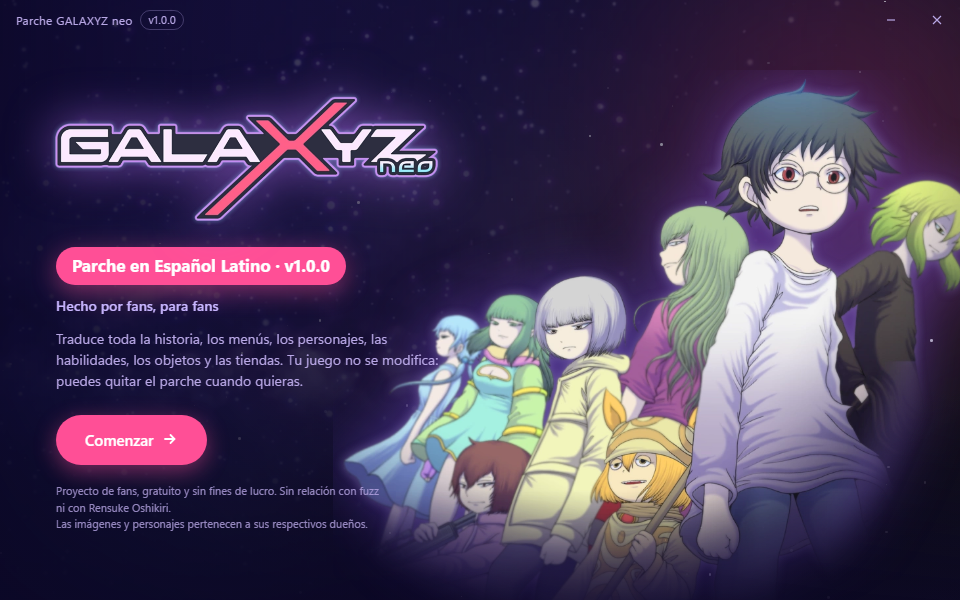
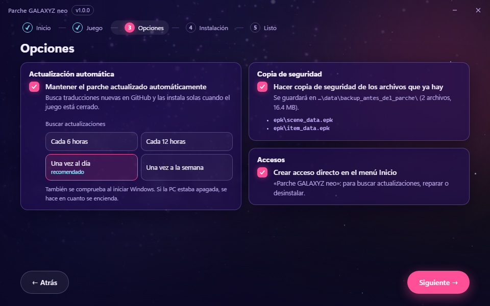

<p align="center">
  
</p>

<p align="center">
  <a href="https://github.com/NexusChaser/galaxyz-neo-espanol-latino/releases/latest"></a>
  
  
  
</p>

<p align="center">
  <a href="https://github.com/NexusChaser/galaxyz-neo-espanol-latino/releases/latest/download/GalaxyzNeoES.exe"><b>⬇️ Descargar instalador</b></a>
  &nbsp;·&nbsp;
  <a href="https://github.com/NexusChaser/galaxyz-neo-espanol-latino/releases/latest/download/GALAXYZ-neo-Espanol-Latino.zip"><b>🗜️ ZIP (.bat / manual)</b></a>
  &nbsp;·&nbsp;
  <a href="#-instalación"><b>📦 Instalación</b></a>
  &nbsp;·&nbsp;
  <a href="https://github.com/NexusChaser/galaxyz-neo-espanol-latino/issues/new/choose"><b>📝 Reportar un error</b></a>
</p>

---

## 🌌 Sobre el parche

Traducción **no oficial** al **español latino** de **GALAXYZ neo**, versión de PC (Windows).
Un proyecto **hecho por fans, para fans**.

### ✅ Qué está traducido

**Todo el texto editable del juego**, es decir, todo lo que el juego muestra como texto:

| | Contenido |
|---|---|
| 🎬 | **Historia completa**: todos los diálogos y escenas (más de 23 000 líneas) |
| 🧭 | **Menús e interfaz**, mensajes del sistema y diálogos del asistente del menú principal |
| 👥 | **Personajes**: nombres, trabajos/clases, especies y perfiles |
| ⚔️ | **Combate**: habilidades, acciones, estados alterados, elementos y tipos de ataque |
| 🎒 | **Objetos**, orbes y boletos |
| 🛒 | **Tiendas**: gacha, canjes, tienda de puntos, mejoras temporales y Piedras Galácticas |
| 🗺️ | **Misiones**: partes, capítulos, secciones, los 1388 niveles y sus condiciones de victoria/derrota |
| 🎁 | **Bonus de inicio de sesión** y caja de regalos |

### 🖼️ Qué falta por traducir

Los **textos que forman parte de una imagen** (texto "pegado" en ilustraciones, logos, carteles,
botones dibujados, etc.) **todavía no están traducidos**. Eso llegará en **futuras actualizaciones**.

---

## 📦 Instalación

Hay **dos formas** de instalar el parche. Usa la que prefieras; el resultado es el mismo.

| | Forma | Para quién |
|---|---|---|
| ⭐ | **[Instalador](#forma-1)** (`GalaxyzNeoES.exe`) | **Recomendada.** La fácil: detecta el juego, se actualiza solo y se desinstala desde Windows. |
| 🗜️ | **[ZIP con `.bat` o a mano](#forma-2)** | Si prefieres no ejecutar el instalador o quieres copiar los archivos tú mismo. |

<a id="forma-1"></a>

### ⭐ Forma 1: instalador (recomendada)

1. Asegúrate de que el juego esté **cerrado**.
2. **[Descarga `GalaxyzNeoES.exe`](https://github.com/NexusChaser/galaxyz-neo-espanol-latino/releases/latest/download/GalaxyzNeoES.exe)** y ábrelo.
3. Sigue los pasos: **Comenzar → Juego → Opciones → Instalar**.

<p align="center">
  
  &nbsp;
  
</p>

> [!IMPORTANT]
> **¿Sale «Windows protegió tu PC»?** Es normal: el instalador **no está firmado** (firmar programas
> cuesta dinero y esto es un proyecto de fans). Pulsa **Más información → Ejecutar de todas formas**.

Qué hace el instalador:

- 🔎 **Busca el juego** en Steam y la carpeta del parche. Si tu juego está en otro sitio, puedes elegir las
  carpetas a mano (se comprueban al momento).
- 💾 Hace **copia de seguridad** solo si hace falta (por ejemplo, si tenías otro mod) y, si algo falla,
  **deshace todo**.
- 🔄 **Actualización automática (opcional):** busca versiones nuevas de la traducción en esta página y
  las instala solas cuando el juego está cerrado. Puedes elegir cada cuánto (cada 6 h, 12 h, **una vez al
  día** o una vez a la semana) o desactivarla y activarla después desde **Parche GALAXYZ neo → Cambiar
  opciones**. Para funcionar sin permisos de administrador añade una entrada al inicio de Windows y una
  tarea programada del usuario; al desactivarla o desinstalar se quitan.
- 🛠️ Desde el menú Inicio (**Parche GALAXYZ neo**) puedes **buscar actualizaciones, reparar o desinstalar**.
  También aparece en **Configuración → Aplicaciones instaladas**.

<a id="forma-2"></a>

### 🗜️ Forma 2: ZIP con `.bat` o manual

1. Asegúrate de que el juego esté **cerrado**.
2. **[Descarga el ZIP](https://github.com/NexusChaser/galaxyz-neo-espanol-latino/releases/latest/download/GALAXYZ-neo-Espanol-Latino.zip)** y descomprímelo.
3. Haz doble clic en **`instalar.bat`**.

¡Y listo! `instalar.bat` copia los archivos traducidos en `%LOCALAPPDATA%\fuzz\galaxyz\data\`
y crea las carpetas si no existen. Si ahí ya había archivos `.epk` (por ejemplo de otro mod), antes
los guarda en `backup_antes_del_parche\`. Con esta forma **no hay actualización automática**: para una
versión nueva, descarga el ZIP otra vez.

> [!NOTE]
> **Tu juego no se modifica.** Los archivos originales siguen dentro del paquete del juego. Al
> arrancar, el juego mira si hay archivos sueltos en esa carpeta y, si los hay, **los usa en lugar de
> los del paquete**. Por eso basta con copiarlos ahí, y por eso desinstalar es tan simple como borrarlos.

> [!WARNING]
> **¿El juego se cierra al arrancar las primeras veces? ¡No te rindas!**
>
> Es **normal** que, con el parche, el juego **se cierre solo mientras carga en la pantalla de inicio**.
> **Sigue abriéndolo hasta que entre: sí funciona.**
>
> La cantidad de intentos **no es fija**: a veces entra a la primera y otras veces hacen falta varios.
> Todavía no sabemos por qué pasa.
>
> - Suele pasar más al abrir el juego **por primera vez** o **después de reiniciar la PC**.
> - Una vez que logró arrancar, lo más probable es que las siguientes veces entre con **pocos intentos o a la primera**.
>
> Cuando ya está dentro, el juego funciona con normalidad.

<details>
<summary><b>🛠️ Instalación manual (sin el .bat)</b></summary>

<br>

Copia **todos** los archivos de la carpeta `epk/` del ZIP en estas carpetas. **Si no existen, créalas**:
es normal que no estén, el juego no las crea.

```
%LOCALAPPDATA%\fuzz\galaxyz\data\locale\us\epk\
%LOCALAPPDATA%\fuzz\galaxyz\data\epk\
%LOCALAPPDATA%\fuzz\galaxyz\data\root\epk\
```

Para llegar rápido: pulsa `Win + R`, escribe `%LOCALAPPDATA%` y presiona Enter.

La que de verdad importa es `locale\us\epk`, que es la que sustituye los textos en inglés. El parche
se probó copiando los archivos en las tres, así que recomendamos hacer lo mismo.

Si el ZIP trae una carpeta `extra/`, copia su contenido **tal cual** dentro de
`%LOCALAPPDATA%\fuzz\galaxyz\data\` (respetando las subcarpetas).

</details>

<details>
<summary><b>↩️ Desinstalación</b></summary>

<br>

- **Si usaste el instalador:** menú Inicio → **Parche GALAXYZ neo → Desinstalar**, o
  **Configuración → Aplicaciones → Aplicaciones instaladas → Parche GALAXYZ neo → Desinstalar**.
- **Si usaste el ZIP:** doble clic en **`desinstalar.bat`**.

En los dos casos se borran los archivos del parche, se devuelven los que hubiera en la copia de
seguridad y se quitan las carpetas que queden vacías. El juego vuelve a usar sus textos originales y
tu partida no se toca.

A mano: borra los `.epk` del parche de las carpetas de arriba. **No borres toda la carpeta `data`**,
porque el juego guarda ahí otras cosas suyas (por ejemplo `user\`).

</details>

<details>
<summary><b>❓ Notas y problemas comunes</b></summary>

<br>

- El juego debe estar en **inglés**: el parche reemplaza los textos en inglés.
- Si el juego se **actualiza**, el parche sigue puesto, pero puede no ser compatible con la nueva
  versión. El instalador te avisa y te ofrece quitarlo hasta que haya una versión compatible. Con el ZIP,
  si ves textos raros o el juego deja de arrancar después de una actualización, desinstala el parche
  y espera a una versión nueva.
- Los registros del instalador están en `%LOCALAPPDATA%\GalaxyzNeoES\logs\`. Si reportas un problema
  con el instalador, adjunta el del día.
- **No abras ni edites** los `.epk` con un editor de texto: están cifrados y el juego se cierra si están dañados.

</details>

---

## 🐞 ¿Encontraste un error?

La traducción es enorme y **hay fallas en algunas partes**. Algunas secciones se tradujeron a mano y
otras con ayuda de **traductores automáticos (como DeepL)**, así que puedes encontrar frases raras,
textos cortados, algo que quedó en inglés o un nombre que no coincide.

**Cualquier cosa rara que veas, avísanos** para poder corregirla.

👉 **[Abre un reporte aquí](https://github.com/NexusChaser/galaxyz-neo-espanol-latino/issues/new/choose)**.
Si puedes, dinos **dónde aparece** (menú, capítulo, personaje) y adjunta una **captura de pantalla**.

---

## 🧑‍💻 Para colaboradores

Cómo está hecho el instalador, cómo publicar una versión nueva y cómo añadir imágenes traducidas:
**[docs/INSTALADOR.md](docs/INSTALADOR.md)**.

---

## 💜 Agradecimientos

- **[kurikomoe](https://github.com/kurikomoe)**, creador de **[FSNr_tools](https://github.com/kurikomoe/FSNr_tools)**.
  Esa herramienta sirvió para descifrar y volver a cifrar los archivos del juego, ya que usa el mismo
  motor. También documenta cómo el motor carga archivos sueltos desde `%LOCALAPPDATA%` en lugar de
  los del paquete, que es justo lo que hace funcionar este parche. **Sin ella este parche no habría
  sido posible.** ¡Muchas gracias!
- A todos los que prueban el parche y reportan errores.

---

## ⚖️ Aviso legal

Este es un **proyecto de fans para fans**, **gratuito** y **sin fines de lucro**.

**No tenemos ninguna relación con fuzz ni con Rensuke Oshikiri**, ni contamos con su respaldo.
GALAXYZ neo, sus personajes y todo su contenido pertenecen a sus respectivos dueños.
Si te gusta el juego, apoya a sus creadores.
