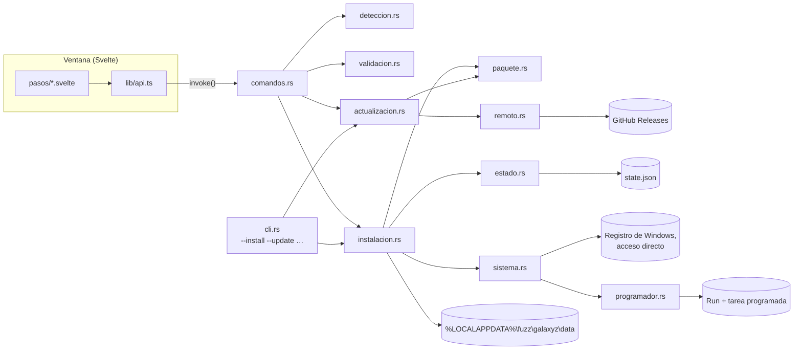
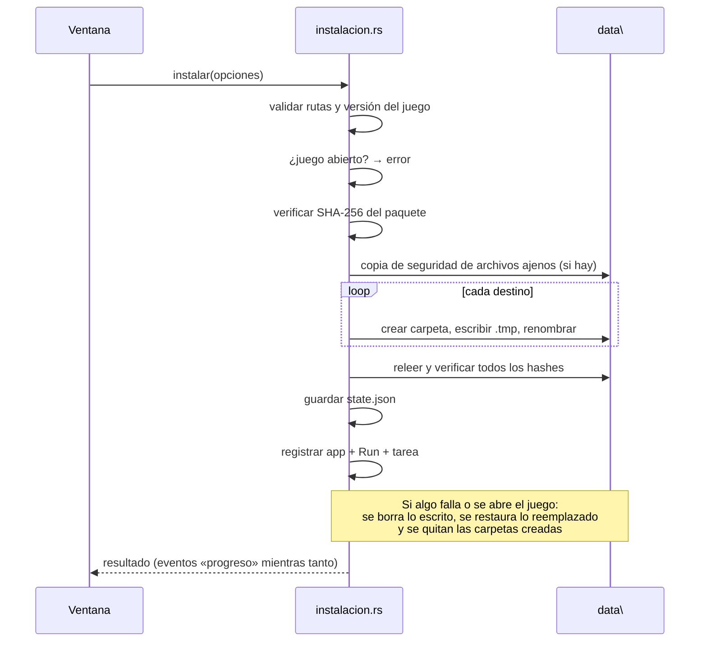

# 🛠️ Instalador del parche — arquitectura y mantenimiento

Guía para quien mantenga el parche: cómo está hecho el instalador (`GalaxyzNeoES.exe`), cómo publicar
una versión nueva de la traducción, cómo **añadir imágenes traducidas** y cómo cambiar el propio
instalador.

> Proyecto de fans, para fans. Sin relación con fuzz ni con Rensuke Oshikiri.

## Índice

1. [Resumen en 1 minuto](#1-resumen-en-1-minuto)
2. [Cómo funciona el parche](#2-cómo-funciona-el-parche)
3. [Estructura del repositorio](#3-estructura-del-repositorio)
4. [Arquitectura del instalador](#4-arquitectura-del-instalador)
5. [Formatos: `manifest.json` y `state.json`](#5-formatos-manifestjson-y-statejson)
6. [Actualización automática](#6-actualización-automática)
7. [Publicar una versión nueva de la traducción](#7-publicar-una-versión-nueva-de-la-traducción)
8. [Añadir imágenes traducidas](#8-añadir-imágenes-traducidas)
9. [Cambiar el instalador](#9-cambiar-el-instalador)
10. [Desarrollo y pruebas](#10-desarrollo-y-pruebas)
11. [Problemas conocidos y decisiones](#11-problemas-conocidos-y-decisiones)

---

## 1. Resumen en 1 minuto

- El juego lee **archivos sueltos** de `%LOCALAPPDATA%\fuzz\galaxyz\data\` antes que los de su OBB. El
  parche solo copia archivos ahí; **el juego no se modifica**.
- El instalador es una app **Tauri 2**: interfaz en **Svelte** (`installer/src`) y lógica en **Rust**
  (`installer/src-tauri`). Los archivos del parche van **dentro del `.exe`**.
- Cada release de GitHub publica `GalaxyzNeoES.exe`, `GALAXYZ-neo-Espanol-Latino.zip` (con los `.bat`) y
  `manifest.json`. El instalador ya instalado lee ese `manifest.json` para actualizarse solo.
- **Para publicar:** cambias los archivos (`epk/` o `extra/`), subes la versión en 3 sitios, escribes
  `docs/notas/vX.Y.Z.md` y subes la etiqueta `vX.Y.Z`. GitHub Actions hace el resto.

---

## 2. Cómo funciona el parche

El motor del juego es el mismo que el de *Fate/stay night REMASTERED*
([FSNr_tools](https://github.com/kurikomoe/FSNr_tools)). Antes de leer un archivo de `obb\pack00d.bin`
busca el mismo archivo suelto en `%LOCALAPPDATA%\fuzz\galaxyz\data\` + la ruta interna con `\` en vez de
`#`. Si existe, **usa el suelto**.

| Dentro del OBB | Archivo suelto que lo sustituye | Qué es |
|---|---|---|
| `locale#us#epk#scene_data.epk` | `data\locale\us\epk\scene_data.epk` | Textos en inglés → **traducción** |
| `epk#scene_data.epk` | `data\epk\scene_data.epk` | Tablas base |
| `res#gui#textures#TEST#logo.webp` | `data\res\gui\textures\TEST\logo.webp` | Imágenes de la interfaz |

Consecuencias que el instalador respeta:

- La carpeta `data\` y sus subcarpetas **pueden no existir**: el instalador las crea.
- **Desinstalar = borrar los archivos del parche.** Los originales siguen en el OBB.
- `%LOCALAPPDATA%` se lee **de la variable de entorno**, igual que el juego.
- Nunca se tocan `data\user\`, `tmp\`, `crash\`, `.patch\` ni `error.log`: son del juego.

---

## 3. Estructura del repositorio

```
galaxyz-neo-espanol-latino/
├─ epk/                         ← .epk traducidos (se copian a locale\us\epk, epk y root\epk)
├─ extra/                       ← archivos con ruta propia dentro de data\ (imágenes traducidas…)
├─ instalar.bat / desinstalar.bat
├─ README.md                    ← página para jugadores
├─ docs/
│  ├─ INSTALADOR.md             ← este documento
│  ├─ notas/vX.Y.Z.md           ← notas de cada release (obligatorias para publicar)
│  └─ capturas/                 ← imágenes del README
├─ .github/
│  ├─ workflows/publicar.yml    ← compila y publica al subir una etiqueta
│  └─ ISSUE_TEMPLATE/           ← formulario de «Error de traducción»
└─ installer/
   ├─ src/                      ← interfaz (Svelte 5 + TypeScript)
   │  ├─ App.svelte             ← qué pantalla se ve
   │  ├─ pasos/                 ← una pantalla por archivo
   │  ├─ componentes/           ← piezas reutilizables
   │  ├─ lib/api.ts             ← tipos y llamadas al backend
   │  ├─ lib/asistente.svelte.ts← estado compartido del asistente
   │  ├─ lib/simulacion.ts      ← datos de ejemplo para ver pantallas sin Tauri (solo desarrollo)
   │  ├─ assets/                ← imágenes del juego (title, logo, chara, phobos1/2, kumo1)
   │  └─ estilos/               ← tokens.css (colores) y base.css
   ├─ src-tauri/
   │  ├─ build.rs               ← mete epk/ y extra/ dentro del ejecutable
   │  ├─ payload/manifest.base.json ← versión del parche, versiones del juego y carpetas destino
   │  ├─ src/                   ← backend en Rust (ver §4)
   │  ├─ icons/                 ← ícono (la X del logo)
   │  └─ tauri.conf.json        ← ventana, versión, permisos
   └─ scripts/generar-manifest.mjs ← genera el manifest.json de cada release
```

---

## 4. Arquitectura del instalador



### Backend (`installer/src-tauri/src`)

| Módulo | Responsabilidad |
|---|---|
| `lib.rs` | Arranque: si hay argumentos sin ventana (`--silent`), ejecuta la CLI; si no, abre la ventana |
| `cli.rs` | Argumentos: `--install`, `--uninstall`, `--repair`, `--update`, `--silent`, `--dry-run`, `--data-path`, `--game-path`, `--update-every`… |
| `comandos.rs` | Lo que la interfaz llama con `invoke()`; ejecuta en segundo plano y emite eventos `progreso` |
| `paquete.rs` | El parche: archivos incluidos (`build.rs`) o descargados (caché); `destinos()` dice dónde va cada copia |
| `deteccion.rs` | Steam (registro, `libraryfolders.vdf`, `appmanifest_*.acf`), registro de desinstalación, `ver.dat`, juego abierto |
| `validacion.rs` | Rutas del juego y del parche, espacio, permisos, clasificación de lo que ya hay (vacía / parche / ajenos) |
| `instalacion.rs` | Copia de seguridad, escritura `.tmp` + renombrado, verificación SHA-256, **vuelta atrás**, reparar y desinstalar |
| `actualizacion.rs` | Buscar y aplicar versiones nuevas, auto-reparación, frecuencia, actualizar el propio instalador |
| `remoto.rs` | Descargas HTTPS desde GitHub Releases con comprobación de hash |
| `programador.rs` | Valor `Run` y tarea programada (XML) para la actualización automática, sin administrador |
| `sistema.rs` | `Entorno` real: copia el programa a `%LOCALAPPDATA%\Programs\GalaxyzNeoES`, «Aplicaciones instaladas», acceso directo |
| `estado.rs` | `state.json` (escritura atómica) |
| `candado.rs` | Evita dos operaciones a la vez (ventana y actualización en segundo plano) |
| `notificacion.rs` · `log.rs` | Notificaciones de Windows · registros en `%LOCALAPPDATA%\GalaxyzNeoES\logs` |
| `version.rs` · `hash.rs` · `error.rs` | Utilidades |

**`Entorno`** (`instalacion.rs`) es el único punto que toca el sistema real (procesos, registro, rutas de
la app). En las pruebas se sustituye por uno falso, así la lógica de instalación se prueba entera sin
tocar Windows.

### Flujo de una instalación



### Interfaz (`installer/src`)

| Pantalla (`pasos/`) | Cuándo |
|---|---|
| `Bienvenida` | Al abrir sin parche instalado |
| `Deteccion` / `JuegoNoEncontrado` | Rutas del juego y del parche (Automático/Manual con validación en vivo) |
| `Opciones` | Actualización automática + frecuencia, copia de seguridad, acceso directo |
| `Resumen` → `Instalando` → `Listo` | Instalación |
| `Mantenimiento` | Al abrir con el parche instalado: actualizar, reparar, cambiar opciones, desinstalar |

Estado compartido en `lib/asistente.svelte.ts` (runas de Svelte 5). Colores en `estilos/tokens.css`.

---

## 5. Formatos: `manifest.json` y `state.json`

### `manifest.json` (se publica en cada release)

```json
{
  "version": "1.2.0",
  "released": "2026-10-01",
  "gameVersions": ["20260210_102029"],
  "targets": ["locale\\us\\epk", "epk", "root\\epk"],
  "files": [
    { "name": "scene_data.epk", "size": 17279160, "sha256": "…" },
    { "name": "logo.webp", "path": "res\\gui\\textures\\TEST\\logo.webp", "size": 35176, "sha256": "…" }
  ],
  "knownPatchHashes": { "1.1.0": { "scene_data.epk": "…" } },
  "zip": { "url": "GALAXYZ-neo-Espanol-Latino.zip", "sha256": "…", "size": 12345678 },
  "installer": { "version": "1.2.0", "url": "GalaxyzNeoES.exe", "sha256": "…", "size": 9876543 },
  "notes": "Primer párrafo de docs/notas/v1.2.0.md"
}
```

| Campo | Uso |
|---|---|
| `version` | Versión del parche. Si es mayor que la instalada, hay actualización |
| `gameVersions` | Contenido de `ver.dat` con el que se probó. Si el juego tiene otra, se avisa |
| `targets` | Carpetas donde se copia cada archivo **sin** `path` |
| `files[].path` | Si está, el archivo va **solo** a esa ruta dentro de `data\` |
| `knownPatchHashes` | Hashes de versiones anteriores: así se reconocen como del parche (no se «respaldan» ni se niegan a borrar) |
| `zip`, `installer` | URL (relativa a la release) y SHA-256 de lo que se descarga |

Las URL relativas se resuelven contra `…/releases/latest/download/`. `manifest.base.json` es la parte
que se escribe a mano; `files`, `zip`, `installer` y `knownPatchHashes` los rellenan `build.rs` y
`generar-manifest.mjs`.

### `state.json` (`%LOCALAPPDATA%\GalaxyzNeoES\state.json`)

Qué se instaló y con qué opciones: `patchVersion`, `dataPath`, `gamePath`, `gameVersion`, `backup`,
`autoUpdate`, `updateIntervalHours`, `shortcut`, `lastCheck`, `lastCheckResult`,
`unsupportedGameVersion`, `files` (**ruta relativa → SHA-256** de cada copia instalada) y
`createdDirs` (carpetas que creó el instalador, para quitarlas al desinstalar).

---

## 6. Actualización automática

| Pieza | Detalle |
|---|---|
| Disparadores | Valor `HKCU\…\Run\GalaxyzNeoES` (`--update --silent --at-login`) y tarea programada «GalaxyzNeoES - Buscar actualizaciones del parche» (cada 6 h / 12 h / 1 día / 7 días, «ejecutar si se perdió», solo con red). Ninguna pide administrador |
| Frecuencia | La decide el programa con `lastCheck` + `updateIntervalHours` (15 min de margen); los disparadores solo lo despiertan |
| Qué hace | Descarga `manifest.json` → si hay versión nueva y el juego es compatible: espera a que el juego se cierre (máx. 6 h), descarga el ZIP, verifica, guarda la caché en `%LOCALAPPDATA%\GalaxyzNeoES\paquete\` e instala → notificación |
| Juego no soportado | Si `ver.dat` no está en `gameVersions`, no instala nada y avisa una vez; Mantenimiento ofrece «Quitar el parche por ahora» |
| Auto-reparación | Si faltan archivos o cambió su hash, los repone desde el paquete más nuevo (caché o incluido) |
| Instalador | Si `installer.version` es mayor, descarga el `.exe`, verifica el hash y lo cambia por el actual (el viejo queda como `.old.exe` y se borra al siguiente arranque) |
| Desactivar | Mantenimiento → Cambiar opciones. Quita `Run` y la tarea |

La URL es `https://github.com/NexusChaser/galaxyz-neo-espanol-latino/releases/latest/download/manifest.json`
(sin límite de peticiones de la API). **Nunca borres `manifest.json` de la última release**: sin él, los
instaladores ya repartidos no encuentran actualizaciones.

---

## 7. Publicar una versión nueva de la traducción

1. **Cambia los archivos**
   - Textos: sustituye los `.epk` en `epk/` (cifrados, como hoy).
   - Imágenes u otros archivos con ruta propia: ver [§8](#8-añadir-imágenes-traducidas).
2. **Sube la versión** (la misma en los tres sitios; si no coinciden, el workflow se para):
   - `installer/src-tauri/Cargo.toml` → `version = "1.2.0"`
   - `installer/src-tauri/tauri.conf.json` → `"version": "1.2.0"`
   - `installer/src-tauri/payload/manifest.base.json` → `"version": "1.2.0"`
3. Si el juego se actualizó y **probaste** el parche con la versión nueva, añade su `ver.dat` a
   `gameVersions` en `manifest.base.json`. Si ya no funciona con la vieja, quítala.
4. **Escribe las notas** en `docs/notas/v1.2.0.md`. La primera línea (`# …`) es el título de la release;
   el primer párrafo sale en la pantalla Mantenimiento del instalador.
5. **Prueba en local** (ver [§10](#10-desarrollo-y-pruebas)): `cargo test` y una instalación con
   `--data-path` apuntando a una carpeta de prueba.
6. **Publica:**

   ```bash
   git add -A && git commit -m "Versión 1.2.0" && git push
   git tag v1.2.0 && git push origin v1.2.0
   ```

7. GitHub Actions (`.github/workflows/publicar.yml`) comprueba versiones y notas, pasa las pruebas,
   compila, arma el ZIP, genera `manifest.json` (con los hashes de la versión anterior en
   `knownPatchHashes`) y crea la release con los 3 archivos. Síguelo en la pestaña **Actions**.
8. Los instaladores ya repartidos la instalarán solos según su frecuencia; en Mantenimiento se puede
   forzar con «Buscar actualizaciones».

> Si el workflow falla después de crear la etiqueta, corrige, haz push y relánzalo desde **Actions →
> Publicar versión → Run workflow** indicando la etiqueta (sube los archivos a la release existente).

---

## 8. Añadir imágenes traducidas

Las imágenes con texto (logos, botones dibujados, carteles…) están en el OBB con rutas como
`res#gui#textures#TEST#logo.webp`. Se sustituyen igual que los `.epk`: poniendo un archivo suelto en la
misma ruta dentro de `data\`.

### Paso a paso

1. **Extrae la imagen original** del OBB con FSNr_tools (`scripts/dec.py` sobre `pack00d.bin`). Las
   imágenes salen como `.webp` con el nombre interno (`res#gui#textures#TEST#logo.webp`).
2. **Tradúcela** conservando **el mismo formato, las mismas dimensiones y el canal alfa**. Guarda como
   `.webp` (sin pérdida si la original tiene bordes finos o transparencias).
3. **Colócala en `extra/`** cambiando `#` por carpetas:

   ```
   res#gui#textures#TEST#logo.webp  →  extra/res/gui/textures/TEST/logo.webp
   ```

4. **Pruébala a mano antes de publicar:** cópiala a
   `%LOCALAPPDATA%\fuzz\galaxyz\data\res\gui\textures\TEST\logo.webp`, abre el juego y comprueba que se ve.
   (El mecanismo está verificado para los `.epk`; para cada tipo de imagen nuevo conviene confirmarlo
   la primera vez.) Si no cambia, revisa la ruta: tiene que coincidir **exactamente** con la del OBB,
   incluidas mayúsculas y minúsculas.
5. **Publica** como en [§7](#7-publicar-una-versión-nueva-de-la-traducción). No hay que tocar código:
   - `build.rs` mete todo `extra/` dentro del `.exe` con su ruta.
   - `generar-manifest.mjs` lo añade a `manifest.json` con `path`.
   - El workflow copia `extra/` dentro del ZIP.
   - `instalar.bat` y `desinstalar.bat` también instalan y quitan `extra/`.
   - El instalador lo copia **solo** a su ruta (no a las carpetas `epk`), lo verifica, lo repara y lo
     borra al desinstalar como cualquier otro archivo del parche.

### Buenas prácticas con imágenes

- **No renombres** carpetas ni archivos: la ruta es la clave.
- Un archivo por imagen; no metas `.psd` ni fuentes en `extra/` (todo lo que haya ahí se instala).
  `LEEME.md` y `.gitkeep` se ignoran.
- Si una imagen tiene variantes (`_0`, `_1`, `_b`…), tradúcelas todas o el juego mezclará idiomas.
- Anota en `docs/notas/vX.Y.Z.md` qué imágenes se tradujeron.
- Si un día se añade una categoría nueva de archivos (sonido, fuentes…), funciona igual: basta con
  ponerlos en `extra/` con la ruta del OBB.

---

## 9. Cambiar el instalador

| Quiero… | Dónde |
|---|---|
| Cambiar textos de una pantalla | `installer/src/pasos/<Pantalla>.svelte` |
| Cambiar colores o tipografía | `installer/src/estilos/tokens.css` |
| Cambiar las imágenes de la interfaz | `installer/src/assets/` (mismo nombre) |
| Cambiar el ícono | Genera un PNG de 1024×1024 y ejecuta `npx tauri icon ruta.png` en `installer/`; borra `icons/android` e `icons/ios` |
| Añadir una pantalla | Crea `pasos/Nueva.svelte`, añádela a `Pantalla` e `indicePaso` en `lib/asistente.svelte.ts` y al `{#if}` de `App.svelte` |
| Añadir una operación del backend | Función en el módulo que toque → comando en `comandos.rs` → regístralo en `lib.rs` (`generate_handler!`) → tipo y llamada en `lib/api.ts` |
| Cambiar dónde se copian los `.epk` | `targets` en `payload/manifest.base.json` (no hace falta tocar código) |
| Cambiar las frecuencias ofrecidas | `INTERVALOS_PERMITIDOS` en `estado.rs` y `nombreIntervalo` en `lib/api.ts` |
| Soportar la versión completa del juego | Nada: la detección busca por nombre (`GALAXYZ neo*`) y por ejecutable. Si cambia el `.exe`, `EXE_JUEGO` en `deteccion.rs` |
| Permisos de la ventana | `installer/src-tauri/capabilities/default.json` |

Cualquier cambio en el instalador se publica igual que una versión nueva (§7): los instaladores ya
repartidos se actualizarán solos si `installer.version` es mayor.

---

## 10. Desarrollo y pruebas

### Requisitos

Windows 10/11, **Node.js 22+**, **Rust estable** (MSVC) y Visual Studio Build Tools con «Desarrollo de
escritorio con C++». WebView2 ya viene con Windows.

### Comandos

```bash
cd installer
npm install
npm run tauri dev          # ventana real con recarga en caliente
npm run check              # tipos de la interfaz
cd src-tauri && cargo test # pruebas del backend
npx tauri build            # ejecutable final en src-tauri/target/release
```

> ⚠️ La carpeta `src-tauri/target` crece rápido (más de 10 GB en depuración). `cargo clean` la vacía.
> Para ocupar menos: `set CARGO_PROFILE_DEV_DEBUG=0` antes de compilar.

### Ver las pantallas sin Tauri

```bash
npm run dev
# abre http://localhost:5173/?pantalla=mantenimiento   (bienvenida, deteccion, noEncontrado,
#   opciones, resumen, instalando, listo, mantenimiento; añade &ajenos=1, &juegoViejo=1, &danados=1, &sinAuto=1)
```

Los datos de ejemplo están en `src/lib/simulacion.ts` y solo se usan en desarrollo.

### Probar sin tocar tu juego

El juego y el instalador usan `LOCALAPPDATA`, así que basta con cambiarla en la consola:

```bash
set LOCALAPPDATA=C:\pruebas\lad
src-tauri\target\debug\galaxyz-neo-es.exe --install --dry-run     # simula, no escribe
src-tauri\target\debug\galaxyz-neo-es.exe --install --auto-update --update-every 12
src-tauri\target\debug\galaxyz-neo-es.exe --update --silent --force
src-tauri\target\debug\galaxyz-neo-es.exe --uninstall --silent
```

Variables solo de desarrollo (sin efecto en el `.exe` final):

| Variable | Para qué |
|---|---|
| `GALAXYZ_ES_IGNORAR_JUEGO=1` | Instalar en una carpeta de prueba aunque el juego esté abierto |
| `GALAXYZ_ES_REGISTRAR=1` | Registrar de verdad en Windows (Run, tarea, «Aplicaciones instaladas») |
| `GALAXYZ_ES_URL_MANIFEST=http://127.0.0.1:8765/manifest.json` | Probar actualizaciones con una release falsa servida en local |
| `GALAXYZ_PAYLOAD_DIR` / `GALAXYZ_EXTRA_DIR` | Compilar con otros `epk/` o `extra/` |

Para simular una release: arma un ZIP como el publicado, genera su manifiesto con
`node scripts/generar-manifest.mjs --zip … --version 9.9.9 --salida srv/manifest.json`, sírvelo con
`python -m http.server 8765 --directory srv` y usa `GALAXYZ_ES_URL_MANIFEST`.

### Qué cubren las pruebas automáticas (`cargo test`)

Detección de Steam y preferencia por la versión completa · normalización y validación de rutas ·
instalación en carpeta inexistente · copia de seguridad y restauración sin tocar la partida ·
**vuelta atrás si se abre el juego a mitad** · archivos modificados que no se borran · versión no
probada · simulación sin escrituras · **archivos con ruta propia (imágenes)** · comparación de
versiones · ZIP publicado (con `extra/`) · frecuencia · archivos dañados · caché del paquete ·
candado · XML de la tarea · argumentos de la CLI.

### Pruebas manuales antes de una release importante

| Escenario | Esperado |
|---|---|
| PC sin el juego abierto nunca | Crea `fuzz\galaxyz\data\…` e instala |
| Juego en otra biblioteca de Steam | Lo detecta |
| Juego abierto al instalar | Bloquea «Instalar» hasta que se cierre |
| Parche instalado antes con `instalar.bat` | Lo reconoce como parche; no crea copia falsa |
| Actualización con el juego abierto | Espera al cierre |
| Desinstalar desde «Aplicaciones instaladas» | Abre Mantenimiento con la confirmación |
| Escalado de pantalla al 150 % | Interfaz nítida |

---

## 11. Problemas conocidos y decisiones

- **Sin firma de código.** No hay certificado de Microsoft. Windows mostrará «Windows protegió tu PC» la
  primera vez; el README explica cómo continuar. La integridad de lo descargado se asegura con SHA-256.
  Por eso tampoco se usa `tauri-plugin-updater` (exige firma e instaladores NSIS/MSI).
- **El juego se cierra a veces al cargar** con el parche. No depende del instalador; está avisado en el
  README y en la pantalla Listo.
- **Solo existe la Demo** (Steam `4306970`). La detección encontrará la versión completa por nombre.
- **Pendiente de comprobar:** si basta con `locale\us\epk` y sobran `epk\` y `root\epk\`. Si se confirma,
  se cambia `targets` en `manifest.base.json` y se publica.
- **Imágenes:** el mecanismo es el mismo que el de los `.epk`, pero conviene confirmarlo en el juego
  con la primera imagen traducida (§8, paso 4).
